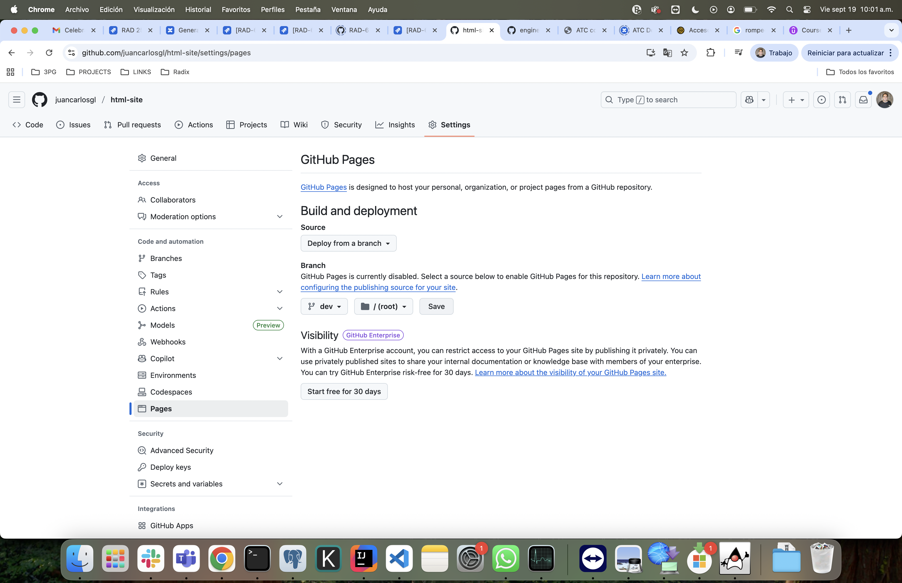
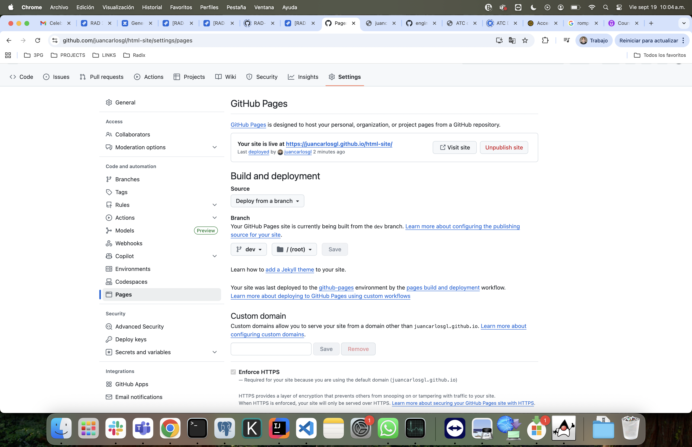

# html-site
html site

main page:
[index.html](https://juancarlosgl.github.io/html-site/)

cards page:
[cards.html](https://juancarlosgl.github.io/html-site/cards.html)

- deploy html site:

Settings >> Page >> Branch

When refresh after a minute os so.

